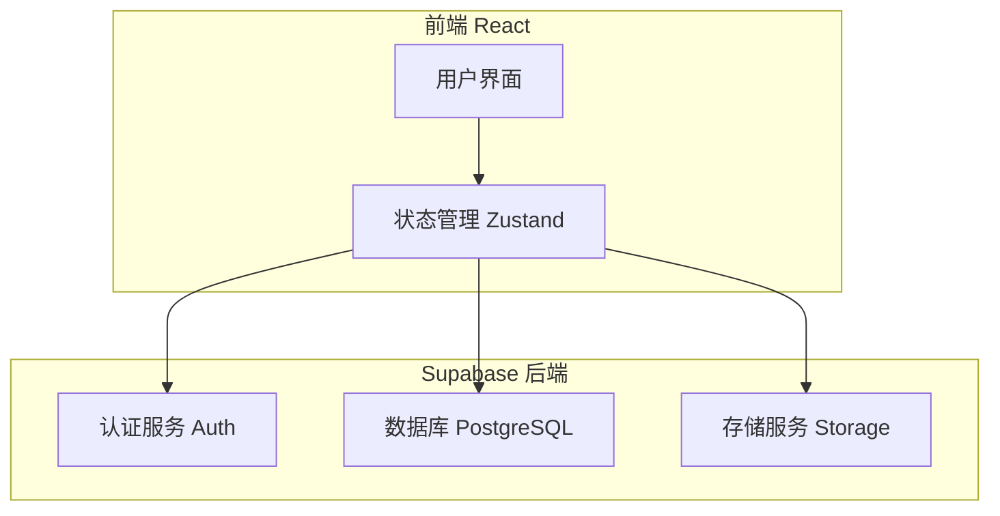
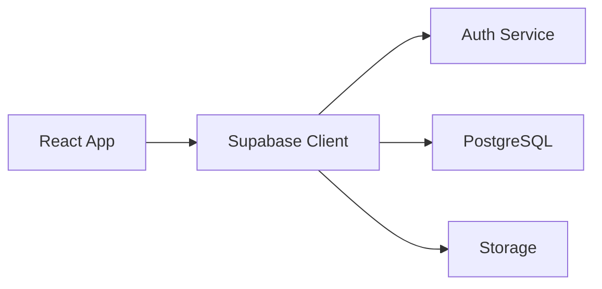
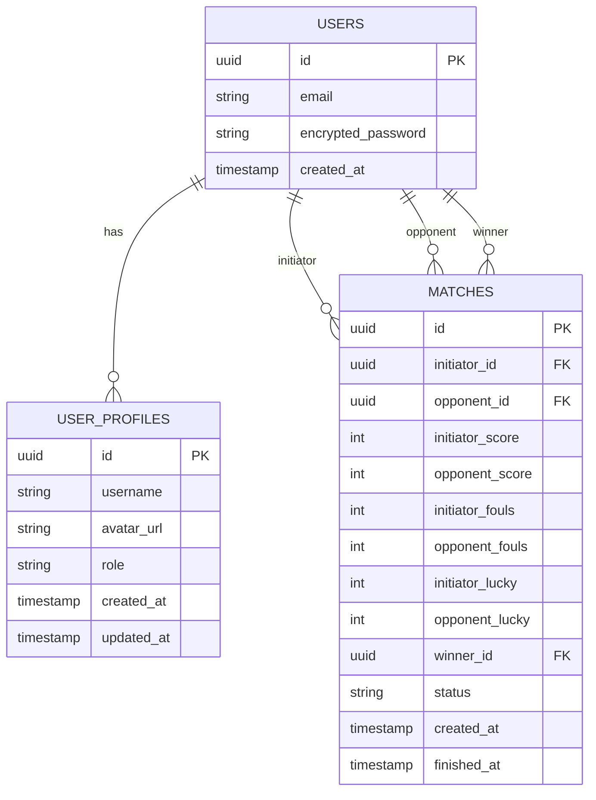

## 1. Architecture Design
使用 React + Supabase 架构，Supabase 提供认证、数据库和存储服务。



## 2. Technology Description
- **前端**: React@18 + TypeScript + tailwindcss@3 + Vite
- **初始化工具**: vite-init
- **后端**: Supabase (认证 + 数据库 + 存储)
- **数据库**: PostgreSQL (Supabase)
- **状态管理**: Zustand + Supabase Auth
- **图标库**: lucide-react

## 3. Route Definitions
| Route | Purpose |
|-------|---------|
| /login | 登录/注册页面 |
| / | 主界面，显示对局列表 |
| /match/:id | 对局详情页，进行计分 |
| /history | 历史记录页面 |
| /profile | 个人设置页面 |

## 4. API Definitions
使用 Supabase Client SDK 直接操作数据库

### 4.1 用户相关
```typescript
// 用户资料扩展表
interface UserProfile {
  id: string; // 对应 auth.users.id
  username: string;
  avatar_url: string | null;
  role: 'admin' | 'user';
  created_at: string;
  updated_at: string;
}
```

### 4.2 对局相关
```typescript
interface Match {
  id: string;
  initiator_id: string;
  opponent_id: string;
  initiator_score: number;
  opponent_score: number;
  initiator_fouls: number; // 白球犯规
  opponent_fouls: number;
  initiator_lucky: number; // 运气球
  opponent_lucky: number;
  winner_id: string | null;
  status: 'pending' | 'playing' | 'finished';
  created_at: string;
  finished_at: string | null;
}
```

### 4.3 统计视图
```typescript
interface UserStats {
  user_id: string;
  total_matches: number;
  wins: number;
  losses: number;
  win_rate: number;
  total_fouls: number;
  total_lucky: number;
}
```

## 5. Server Architecture Diagram
使用 Supabase 托管服务，无需自建服务器



## 6. Data Model

### 6.1 Data Model Definition


### 6.2 Data Definition Language

```sql
-- 用户资料表
CREATE TABLE user_profiles (
    id UUID PRIMARY KEY REFERENCES auth.users(id) ON DELETE CASCADE,
    username TEXT UNIQUE NOT NULL,
    avatar_url TEXT,
    role TEXT NOT NULL DEFAULT 'user' CHECK (role IN ('admin', 'user')),
    created_at TIMESTAMPTZ DEFAULT NOW(),
    updated_at TIMESTAMPTZ DEFAULT NOW()
);

-- 对局表
CREATE TABLE matches (
    id UUID PRIMARY KEY DEFAULT gen_random_uuid(),
    initiator_id UUID NOT NULL REFERENCES auth.users(id) ON DELETE CASCADE,
    opponent_id UUID NOT NULL REFERENCES auth.users(id) ON DELETE CASCADE,
    initiator_score INTEGER DEFAULT 0,
    opponent_score INTEGER DEFAULT 0,
    initiator_fouls INTEGER DEFAULT 0,
    opponent_fouls INTEGER DEFAULT 0,
    initiator_lucky INTEGER DEFAULT 0,
    opponent_lucky INTEGER DEFAULT 0,
    winner_id UUID REFERENCES auth.users(id),
    status TEXT NOT NULL DEFAULT 'pending' CHECK (status IN ('pending', 'playing', 'finished')),
    created_at TIMESTAMPTZ DEFAULT NOW(),
    finished_at TIMESTAMPTZ,
    CONSTRAINT different_players CHECK (initiator_id != opponent_id)
);

-- 索引
CREATE INDEX idx_matches_initiator ON matches(initiator_id);
CREATE INDEX idx_matches_opponent ON matches(opponent_id);
CREATE INDEX idx_matches_status ON matches(status);
CREATE INDEX idx_user_profiles_username ON user_profiles(username);

-- RLS 策略
ALTER TABLE user_profiles ENABLE ROW LEVEL SECURITY;
ALTER TABLE matches ENABLE ROW LEVEL SECURITY;

-- user_profiles 策略
CREATE POLICY "Users can view all profiles" ON user_profiles
    FOR SELECT USING (true);

CREATE POLICY "Users can update own profile" ON user_profiles
    FOR UPDATE USING (auth.uid() = id);

CREATE POLICY "Users can insert own profile" ON user_profiles
    FOR INSERT WITH CHECK (auth.uid() = id);

-- matches 策略
CREATE POLICY "Users can view all matches" ON matches
    FOR SELECT USING (true);

CREATE POLICY "Users can create matches" ON matches
    FOR INSERT WITH CHECK (auth.uid() = initiator_id OR auth.uid() = opponent_id);

CREATE POLICY "Players can update own matches" ON matches
    FOR UPDATE USING (
        auth.uid() = initiator_id OR 
        auth.uid() = opponent_id OR
        EXISTS (
            SELECT 1 FROM user_profiles 
            WHERE id = auth.uid() AND role = 'admin'
        )
    );

-- 触发器：自动创建用户资料
CREATE OR REPLACE FUNCTION public.handle_new_user()
RETURNS TRIGGER AS $$
BEGIN
    INSERT INTO public.user_profiles (id, username)
    VALUES (NEW.id, COALESCE(NEW.raw_user_meta_data->>'username', split_part(NEW.email, '@', 1)));
    RETURN NEW;
END;
$$ LANGUAGE plpgsql SECURITY DEFINER;

CREATE TRIGGER on_auth_user_created
    AFTER INSERT ON auth.users
    FOR EACH ROW EXECUTE FUNCTION public.handle_new_user();

-- 存储桶：头像
INSERT INTO storage.buckets (id, name, public) VALUES ('avatars', 'avatars', true);

-- 存储策略
CREATE POLICY "Anyone can view avatars" ON storage.objects
    FOR SELECT USING (bucket_id = 'avatars');

CREATE POLICY "Users can upload own avatar" ON storage.objects
    FOR INSERT WITH CHECK (
        bucket_id = 'avatars' AND 
        auth.uid()::text = (storage.foldername(name))[1]
    );

CREATE POLICY "Users can update own avatar" ON storage.objects
    FOR UPDATE USING (
        bucket_id = 'avatars' AND 
        auth.uid()::text = (storage.foldername(name))[1]
    );
```

## 7. Deployment

### 7.1 Supabase 配置
1. 创建 Supabase 项目
2. 执行上述 SQL 创建表和策略
3. 配置认证提供者（Email/Password）
4. 设置存储桶权限

### 7.2 前端部署
使用 Vercel 部署前端应用，配置环境变量：
- VITE_SUPABASE_URL
- VITE_SUPABASE_ANON_KEY
