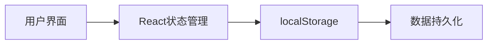

## 1. Architecture Design
这是一个纯前端应用，使用 React 构建，不需要后端或数据库。所有状态都在客户端维护，使用 localStorage 进行持久化存储。



## 2. Technology Description
- **前端**: React@18 + TypeScript + tailwindcss@3 + Vite
- **初始化工具**: vite-init
- **状态管理**: React useState 和 useEffect 钩子
- **持久化**: localStorage
- **图标库**: lucide-react

## 3. Route Definitions
| Route | Purpose |
|-------|---------|
| / | 主计分界面 |

## 4. API Definitions
无需后端 API

## 5. Server Architecture Diagram
无需后端服务

## 6. Data Model

### 6.1 数据结构
不需要数据库，使用以下 TypeScript 类型定义：

```typescript
interface Player {
  id: number;
  name: string;
  score: number;
  color: string;
}

interface ScoreHistoryItem {
  id: string;
  timestamp: Date;
  playerId: number;
  change: number;
  previousScore: number;
  newScore: number;
}

interface GameState {
  players: Player[];
  targetScore: number;
  history: ScoreHistoryItem[];
  winner: Player | null;
}
```
