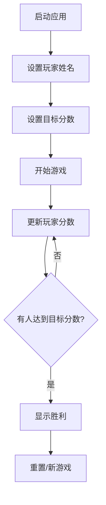

## 1. Product Overview
一个专为4人台球游戏设计的计分工具，提供清晰直观的分数管理功能，支持实时更新和历史记录。
- 解决传统台球计分的繁琐问题，让用户专注于游戏本身
- 适用于休闲台球爱好者和小型台球比赛场景

## 2. Core Features

### 2.1 Feature Module
1. **主界面**: 4位玩家的分数显示、增减分按钮、重置功能
2. **历史记录**: 记录每轮得分变化，支持查看和撤销操作
3. **游戏设置**: 支持玩家姓名自定义和目标分数设置

### 2.3 Page Details
| Page Name | Module Name | Feature description |
|-----------|-------------|---------------------|
| 主界面 | 玩家分数显示 | 大字体显示每位玩家当前分数，突出显示领先者 |
| 主界面 | 分数控制 | 每位玩家有独立的加减分按钮，支持1分、5分、10分快速增减 |
| 主界面 | 游戏控制 | 重置游戏、开始新游戏、保存游戏记录 |
| 历史记录 | 得分历史 | 时间线显示每轮得分变化，支持撤销操作 |

## 3. Core Process
用户启动应用后，输入4位玩家姓名，设置目标分数，开始游戏。每轮结束后，通过按钮增减对应玩家分数，系统自动更新历史记录。当有玩家达到目标分数时，显示胜利画面。

## 4. User Interface Design

### 4.1 Design Style
- **主色调**: 深绿色(#1B5E20)和金色(#FFD700)，营造经典台球厅氛围
- **辅助色**: 深棕色和木质纹理背景
- **按钮风格**: 圆角设计，带有阴影和悬停效果
- **字体**: 粗体数字显示分数，清晰易读
- **布局**: 卡片式布局，每位玩家独立区域，顶部导航栏
- **图标**: 使用台球杆、球、奖杯等相关图标

### 4.2 Page Design Overview
| Page Name | Module Name | UI Elements |
|-----------|-------------|-------------|
| 主界面 | 玩家卡片 | 垂直排列4个卡片，每个包含玩家名、分数、加减分按钮 |
| 主界面 | 控制区 | 顶部固定栏，包含重置、历史记录、设置按钮 |
| 历史记录 | 历史列表 | 可滚动列表，显示时间戳和得分变化 |

### 4.3 Responsiveness
- 桌面端优先，适配平板和手机屏幕
- 在小屏幕上调整为单列布局
- 按钮大小优化，确保触摸操作友好

### 4.4 3D Scene Guidance
不适用
