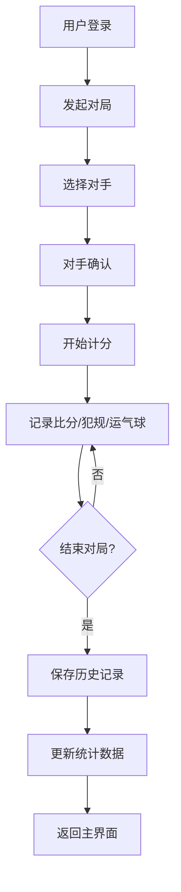

## 1. Product Overview
一个专为4人台球游戏设计的在线计分平台，支持用户登录、比赛管理、数据统计和历史记录查询。
- 解决传统台球计分的繁琐问题，支持多人在线协作记录比赛数据
- 适用于休闲台球爱好者、台球俱乐部和小型台球比赛场景

## 2. Core Features

### 2.1 User Roles
| Role | Registration Method | Core Permissions |
|------|---------------------|------------------|
| 管理员 | 系统预设 | 修改所有对局数据、管理用户账号、查看所有历史记录 |
| 普通用户 | 注册账号 | 发起对局、录入自己参与的对局数据、查看历史记录、上传头像 |

### 2.2 Feature Module
1. **登录/注册页面**: 用户账号登录、新用户注册、头像上传
2. **主界面**: 发起对局、进行中的对局、快速计分
3. **对局详情**: 比分统计、白球犯规记录、运气球记录
4. **历史记录**: 所有历史对局列表、个人战绩统计、胜率分析
5. **用户设置**: 个人信息修改、头像管理

### 2.3 Page Details
| Page Name | Module Name | Feature description |
|-----------|-------------|---------------------|
| 登录页 | 登录表单 | 用户名密码登录，支持记住登录状态 |
| 登录页 | 注册表单 | 新用户注册，支持头像上传（≤2M） |
| 主界面 | 发起对局 | 选择对手，发起新对局请求 |
| 主界面 | 进行中对局 | 显示当前用户参与的对局，可进入计分 |
| 对局详情 | 比分统计 | 双方比分显示，加减分操作 |
| 对局详情 | 白球犯规 | 记录白球犯规次数，影响统计 |
| 对局详情 | 运气球 | 记录运气球次数，影响统计 |
| 对局详情 | 结束对局 | 确认比赛结果，保存到历史记录 |
| 历史记录 | 对局列表 | 显示所有历史对局，支持筛选 |
| 历史记录 | 个人统计 | 胜场、败场、胜率、白球犯规率、运气球率 |
| 历史记录 | 管理员功能 | 管理员可编辑/删除任意对局记录 |

## 3. Core Process

### 3.1 用户注册登录流程
用户注册账号并上传头像 → 管理员审核（可选）→ 用户登录系统 → 进入主界面

### 3.2 对局流程
用户A发起对局邀请用户B → 用户B确认接受 → 开始对局 → 双方轮流计分 → 记录白球犯规和运气球 → 任一方点击结束对局 → 数据保存到历史记录

## 4. User Interface Design

### 4.1 Design Style
- **主色调**: 深绿色(#1B5E20)和金色(#FFD700)，营造经典台球厅氛围
- **辅助色**: 深棕色和木质纹理背景
- **按钮风格**: 圆角设计，带有阴影和悬停效果
- **字体**: 粗体数字显示分数，清晰易读
- **布局**: 卡片式布局，响应式设计
- **图标**: 使用台球杆、球、奖杯等相关图标

### 4.2 Page Design Overview
| Page Name | Module Name | UI Elements |
|-----------|-------------|-------------|
| 登录页 | 登录表单 | 居中卡片，用户名密码输入框，登录按钮 |
| 登录页 | 头像上传 | 头像预览，上传按钮，文件大小提示 |
| 主界面 | 对局列表 | 卡片列表，显示对手信息和状态 |
| 对局详情 | 计分板 | 双方分数大字显示，加减分按钮组 |
| 对局详情 | 统计项 | 白球犯规计数，运气球计数 |
| 历史记录 | 统计图表 | 胜率饼图，数据表格 |

### 4.3 Responsiveness
- 桌面端优先，适配平板和手机屏幕
- 在小屏幕上调整为单列布局
- 按钮大小优化，确保触摸操作友好

### 4.4 3D Scene Guidance
不适用

## 5. Data Requirements

### 5.1 用户数据
- 用户ID、用户名、密码哈希、头像URL、角色（管理员/普通用户）
- 创建时间、更新时间

### 5.2 对局数据
- 对局ID、发起者ID、对手ID、发起者分数、对手分数
- 发起者白球犯规次数、对手白球犯规次数
- 发起者运气球次数、对手运气球次数
- 胜者ID、对局状态（进行中/已结束）、创建时间、结束时间

### 5.3 统计数据
- 用户ID、总对局数、胜场数、败场数、胜率
- 总白球犯规次数、总运气球次数
